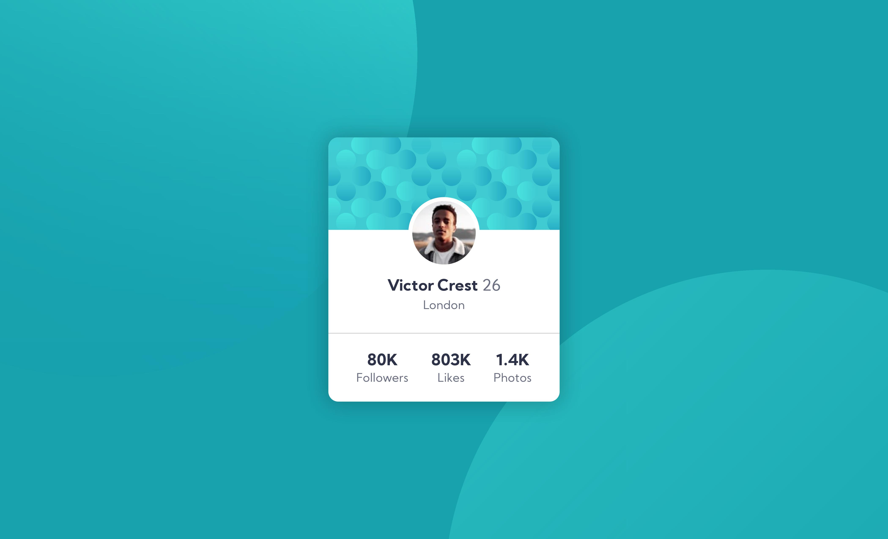

# Frontend Mentor - Profile card component solution

This is a solution to the [Profile card component challenge on Frontend Mentor](https://www.frontendmentor.io/challenges/profile-card-component-cfArpWshJ). Frontend Mentor challenges help you improve your coding skills by building realistic projects.

## Table of contents

-   [Overview](#overview)
    -   [The challenge](#the-challenge)
    -   [Screenshot](#screenshot)
    -   [Links](#links)
-   [Author](#author)

## Overview

### The challenge

-   Build out the project to the designs provided

### Screenshot

### Links

-   Solution URL: [Solution](https://www.frontendmentor.io/solutions/profile-card-component-html-css-Pq0ztMeGB)
-   Live Site URL: [Live Site](https://itsmeevil-frontendmentor-solutions.netlify.app/profile-card)

## Author

-   Website - [itsmeEVIL](https://itsmeevil.github.io)
-   Frontend Mentor - [@itsmeEVIL](https://www.frontendmentor.io/profile/itsmeevil)
