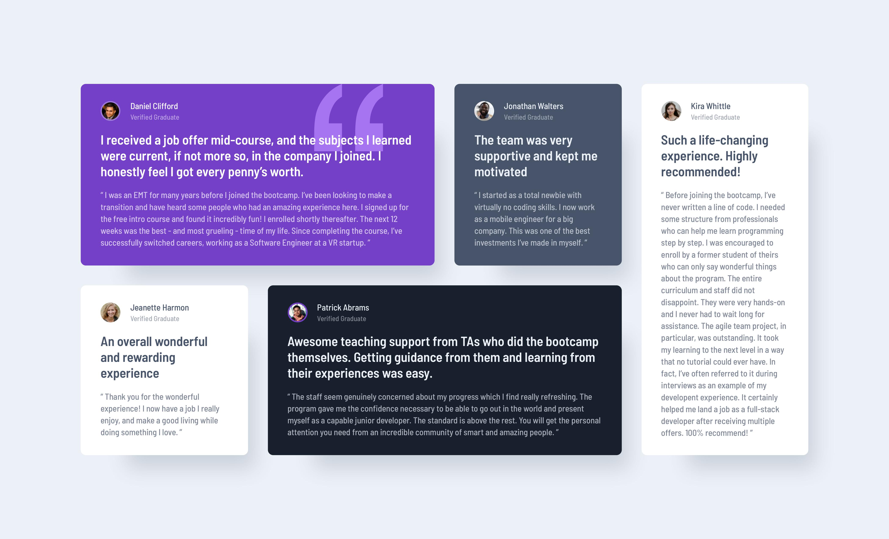

# Frontend Mentor - Testimonials grid section solution

This is a solution to the [Testimonials grid section challenge on Frontend Mentor](https://www.frontendmentor.io/challenges/testimonials-grid-section-Nnw6J7Un7). Frontend Mentor challenges help you improve your coding skills by building realistic projects.

## Table of contents

-   [Overview](#overview)
    -   [The challenge](#the-challenge)
    -   [Screenshot](#screenshot)
    -   [Links](#links)
-   [Author](#author)

## Overview

### The challenge

Users should be able to:

-   View the optimal layout for the site depending on their device's screen size

### Screenshot

### Links

-   Solution URL: [Solution](https://frontendmentor.io/solutions)
-   Live Site URL: [Live Site](https://itsmeevil-frontendmentor-solutions.netlify.app/testimonials-grid-section/)

## Author

-   Website - [itsmeEVIL](https://itsmeEVIL.github.io)
-   Frontend Mentor - [@itsmeEVIL](https://www.frontendmentor.io/profile/itsmeEVIL)
